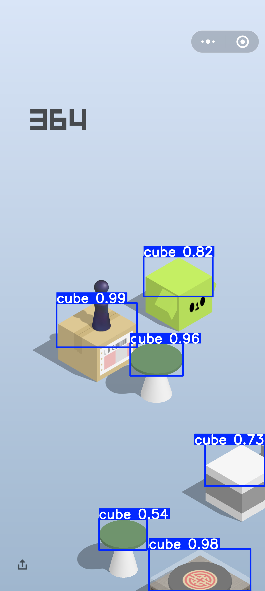
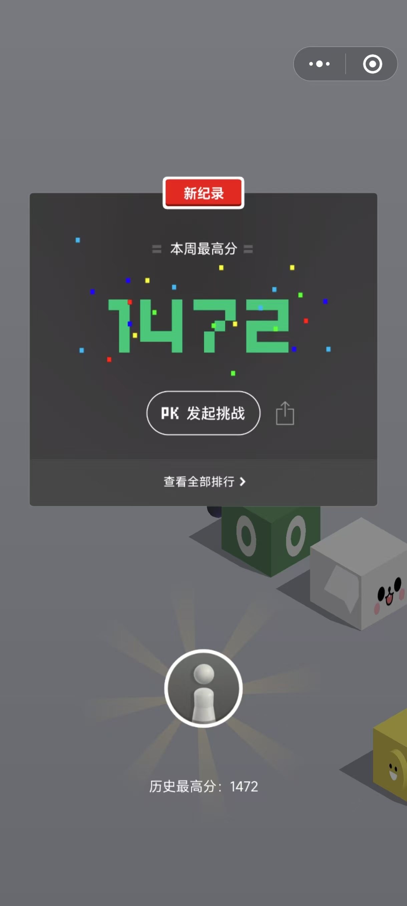
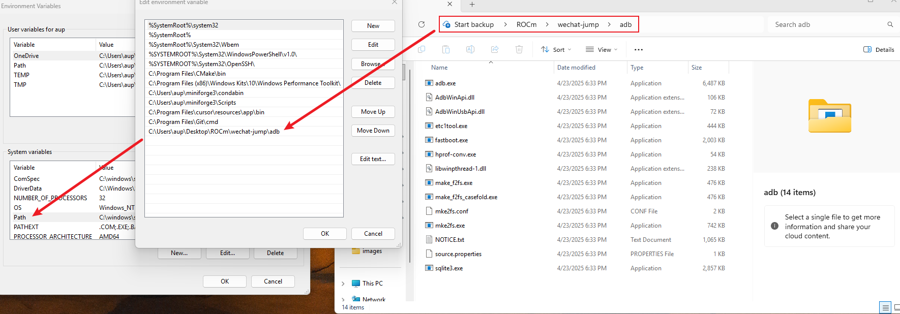

# 微信跳一跳自动化项目 🎮

<div align='center'>


</div>


<div align='center'>
    
    
</div>

基于YOLO目标检测的微信跳一跳游戏自动化工具，通过计算机视觉识别游戏中的小人和目标平台，自动计算距离并控制手机进行精准跳跃。本项目已支持 AMD ROCm 平台训练和推理，支持 Ryzen AI 系列芯片。

## 🌟 项目特色

- 🤖 **智能识别**：使用YOLOv10模型精准识别游戏中的小人和目标平台
- 📏 **距离计算**：通过欧氏距离计算跳跃所需的力度
- 📱 **ADB控制**：自动控制Android手机进行截图和模拟点击
- 🎯 **高精度**：基于深度学习的目标检测，识别准确率高
- 🔄 **自动化**：一键运行，全程自动化操作

## 📋 功能列表

- [x] 自动截图获取游戏画面
- [x] YOLO模型训练和推理
- [ ] 基于多模态大模型做目标检测
- [x] 目标检测和距离计算
  - [x] 减少检测框重复检测
- [x] ADB模拟点击控制
- [x] 数据集制作和标注工具
- [x] 模型训练脚本

## 🛠️ 环境要求

- Python >= 3.13
- Android手机（开启USB调试）
- ADB工具
- macOS/Linux/Windows

## 📦 安装步骤

### 1. 克隆项目
```bash
git clone https://github.com/KMnO4-zx/wechat-jump.git
cd wechat-jump
```

### 2. 安装Python依赖

- NVIDIA CUDA

```bash
pip install -r requirements.txt
```

- AMD ROCm 7.2.0

   - 以 Ryzen AI 系列为例 参考 [支持列表](https://rocm.docs.amd.com/projects/radeon-ryzen/en/latest/docs/compatibility/compatibilityryz/windows/windows_compatibility.html)

```shell
# 安装ROCm相关依赖 包含 torch torchvision torchaudio等核心库
python -m pip install --no-cache-dir "https://repo.radeon.com/rocm/windows/.rocm-rel-7.2_a/rocm_sdk_core-7.2.0.dev0-py3-none-win_amd64.whl"
python -m pip install --no-cache-dir "https://repo.radeon.com/rocm/windows/.rocm-rel-7.2_a/rocm_sdk_devel-7.2.0.dev0-py3-none-win_amd64.whl"
python -m pip install --no-cache-dir "https://repo.radeon.com/rocm/windows/.rocm-rel-7.2_a/rocm_sdk_libraries_custom-7.2.0.dev0-py3-none-win_amd64.whl"
python -m pip install --no-cache-dir "https://repo.radeon.com/rocm/windows/.rocm-rel-7.2_a/rocm-7.2.0.dev0.tar.gz"
python -m pip install --no-cache-dir "https://repo.radeon.com/rocm/windows/.rocm-rel-7.2_a/torch-2.9.1+rocmsdk20260116-cp312-cp312-win_amd64.whl"
python -m pip install --no-cache-dir "https://repo.radeon.com/rocm/windows/.rocm-rel-7.2_a/torchvision-0.24.1+rocmsdk20260116-cp312-cp312-win_amd64.whl"
python -m pip install --no-cache-dir "https://repo.radeon.com/rocm/windows/.rocm-rel-7.2_a/torchaudio-2.9.0+rocmsdk20251116-cp312-cp312-win_amd64.whl"
```

- 安装其他依赖

```shell
pip install -r requirements_rocm_windows.txt
```


### 3. 安装ADB工具

- macOS

```bash
# 使用提供的安装脚本
chmod +x install_adb_mac.sh
./install_adb_mac.sh

# 或手动安装
brew install android-platform-tools
```

- Windows

   - 官方下载：https://developer.android.google.cn/tools/releases/platform-tools?authuser=4&hl=zh-cn

   - 下载并解压后，设置解压路径至系统环境变量中

   <div align='center'>
    
   </div>

### 4. 手机设置
1. 开启开发者选项
2. 启用USB调试
3. 连接电脑并授权ADB调试
4. 验证连接：`adb devices`

## 🚀 使用方法

### 快速开始
```bash
# 运行主程序
python main.py
```

### 数据收集
```bash
# 自动截图收集训练数据
python simple_screenshot.py
```

### 模型训练
```bash
# 1. 准备数据集（使用labelimg标注）
labelimg

# 2. 划分数据集
python dataset_split.py

# 3. 训练模型
python train.py
```

### 模型测试
```bash
# 测试训练好的模型
python detect.py
```

## 📁 项目结构

```
wechat-jump/
├── main.py              # 主程序入口
├── train.py             # 模型训练脚本
├── detect.py            # 模型检测测试
├── dataset_split.py     # 数据集划分工具
├── simple_screenshot.py # 自动截图工具
├── install_adb_mac.sh   # ADB安装脚本(macOS)
├── requirements.txt     # Python依赖
├── pyproject.toml       # 项目配置
├── dataset/             # 数据集目录
├── runs/                # 训练结果目录
└── README.md           # 项目说明
```

## 🎯 核心算法

### 1. 目标检测
使用YOLOv10模型检测游戏中的：
- 目标平台位置

### 2. 距离计算
```python
# 计算两个目标中心点的欧氏距离
distance = np.sqrt((center1_x - center2_x) ** 2 + (center1_y - center2_y) ** 2)
```

### 3. 跳跃控制
```python
# 根据距离计算按压时间，模拟跳跃
jump.adb_tap(x, y, duration_ms)
```

## ⚙️ 配置说明

### 模型配置
- 模型路径：`./runs/detect/train/weights/best.pt`
- 输入尺寸：640x640
- 训练轮数：100 epochs

### ADB配置
- 截图路径：`/sdcard/temp_screenshot.png`
- 本地保存：`./iphone.png`

## 🔧 故障排除

### 常见问题

1. **ADB连接失败**
   ```bash
   # 重启ADB服务
   adb kill-server
   adb start-server
   ```

2. **模型文件不存在**
   - 确保已完成模型训练
   - 检查模型路径是否正确

3. **截图失败**
   - 检查手机USB调试是否开启
   - 确认ADB权限已授权

## 📊 性能指标

- 目标检测准确率：>99.5%
- 跳跃成功率：>90%
- 平均响应时间：<2.5秒

## 🤝 贡献指南

1. Fork 项目
2. 创建特性分支 (`git checkout -b feature/AmazingFeature`)
3. 提交更改 (`git commit -m 'Add some AmazingFeature'`)
4. 推送到分支 (`git push origin feature/AmazingFeature`)
5. 打开 Pull Request

## 📄 许可证

本项目采用 Apache-2.0 license 许可证 - 查看 [LICENSE](LICENSE) 文件了解详情

## ⚠️ 免责声明

本项目仅供学习和研究使用，使用本工具可能违反游戏服务条款，请自行承担风险。

## 📞 联系方式

如有问题或建议，欢迎提交 Issue 或 Pull Request。

---

⭐ 如果这个项目对你有帮助，请给个星星支持一下！
